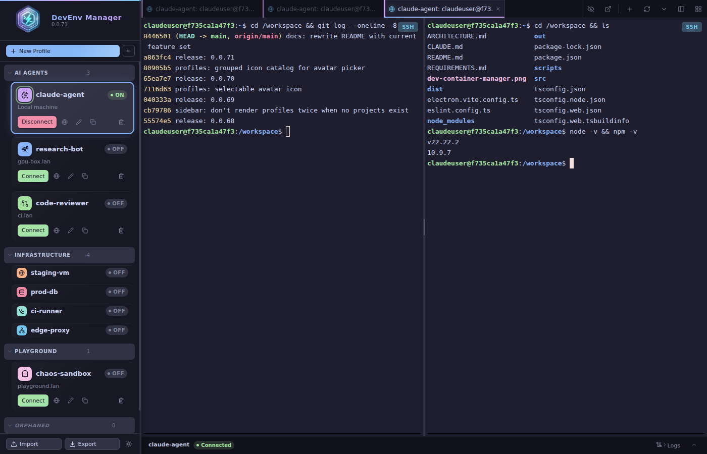

# FaKods Legendary DevContainer Manager

> **STOP. Before you open one more raw SSH session into one more anonymous Docker container — you need to see this.** The ultimate desktop command center for remote development containers: SSH tunnels, live status, split terminals, session restore, and full container control, all in one gorgeous window. It's not called *Legendary* for nothing.



---

## What is it?

Picture this: you're running AI agents inside Docker containers scattered across remote servers. You've got six SSH sessions open, you've forgotten which terminal belongs to which box, and somewhere a port forward silently died twenty minutes ago. Sound familiar? **Those days are OVER.**

FaKods Legendary DevContainer Manager is a **native Electron desktop application** that puts you in absolute command of your development environments — remote *and* local. One click connects the tunnel, starts the container, and drops you into a shell. Close the app, reopen it tomorrow, and your terminals come back like you never left. This isn't a terminal with extra steps. This is a *cockpit*.

No more juggling windows. No more squinting at `docker ps` over SSH. No more "wait, which tab was staging?" Just connect, work, and ship.

---

## The Features (hold on to your keyboard)

### Profile Management — your environments, beautifully organized
- Named **connection profiles** with SSH credentials, container config, port forwards, and connection policies — everything one environment needs, in one tile
- **Projects!** Group profiles into collapsible sections, drag-and-drop profiles between them, rename and delete at will — strays are rounded up into an automatic *Orphaned* section
- **Per-project compact mode** — sidebar getting crowded? Collapse any project's tiles down to icon + name + On/Off badge with one click. Expands just as fast, and every project remembers its own setting across restarts
- **An icon catalog of ~160 hand-picked icons in 12 themed groups** — AI & Agents, Code & Dev, Infrastructure, Data, Docs, Media, Ops, Security, Business, Science, Life, even *Animals*. Give your coding agent a brain circuit, your database box a... database, and your chaos sandbox a ghost 👻
- **16 accent colors** per profile, plus auto-coloring for the undecided — tiles glow green when connected, spin while connecting
- **Import/export profiles as JSON** — ship your entire setup to a teammate in seconds
- One-click **Clone** to duplicate a profile and tweak it

### SSH + Container Lifecycle — the heavy lifting, handled
- Full **SSH tunnel management**: keepalive, identity files, custom options, automatic reconnect policies
- **Local machine mode** — one checkbox and SSH disappears entirely; manage containers right on your own machine
- **Docker container control from the UI** — Start, Stop, Restart, Recreate, Delete. No terminal gymnastics
- Auto-detects the container's default shell from its image `CMD` (yes, really)
- **Live port forward monitoring** — every tunnel shows active/inactive status in real time
- **Auto-connect on startup** — flag a profile and the app reconnects and opens a terminal before you've finished your coffee
- **Container behavior policy** per profile: attach-or-recreate, attach only, start if stopped, or scorched-earth always-recreate

### Terminal — where you'll actually live (and love it)
- Full **xterm.js** terminal, Catppuccin-themed in dark *and* light
- **Session restore across restarts** — quit the app, come back, and your terminal tabs reconnect right where you left them. Witchcraft? No. Engineering
- **Split panes** — vertical or horizontal, each an independent PTY into the container
- **Tile mode** — see *all* your terminals at once in a grid
- **Detachable terminal windows** — pop any terminal out into its own window and drag it to your second monitor where it belongs
- **Hide & restore terminals** — stash noisy terminals out of view; the profile tile shows an eye badge with a count, one click brings them all back
- **Tab strip, your way** — keep tabs on top or flip to a **vertical sidebar mode** with compact chrome and context icons (local / SSH / container at a glance). Drag-and-drop tab reordering included, obviously
- **Reconnect All** button revives every exited terminal in one shot
- **Paste clipboard images and drag-drop files** — they land as paths in the shell, ready to use
- Smart **URL handling** — clickable links even when they're hard-wrapped across lines or buried inside TUI panel borders, and full login URLs survive pane resizes
- Find bar, font zoom, copy/paste shortcuts, right-click paste, 5000 lines of scrollback
- **Dynamic tab + window titles** via OSC title sequences — your tabs name themselves

### Live Status Panel — omniscience, included
- **Always-visible status strip**: profile name, SSH badge, container status, active port count
- Expandable detail panel: SSH connection info, port forward list, container image, action buttons
- **Event log** with per-level color coding, search, profile filtering, and copy-to-clipboard

### Polished UI — because you deserve nice things
- **Glassmorphism** sidebar and status cards — frosted panels, backdrop blur, the works
- **Catppuccin Mocha** dark + **Catppuccin Latte** light, switchable anytime
- Gradient buttons with shimmer hover, animated ping dots for unread terminal activity
- Green glow on connected profiles, spinning ring on connecting avatars
- Spring-animated toasts with countdown bars, and a danger-pulse confirm dialog so you never accidentally nuke the wrong container

---

## Getting Started

### Prerequisites

- Node.js 22+
- `openssh-client` (for the SSH tunnels)
- Docker on the remote host (or locally, for local machine mode)

### Install & Run

```bash
npm install
npm run dev
```

### Build AppImage (Linux x64)

```bash
npm run dist
# Output: dist/FaKods Legendary DevContainer Manager-<version>.AppImage
```

### Build DMG (macOS)

Run on a macOS machine with Xcode command-line tools installed:

```bash
xcode-select --install   # one-time setup
npm install
npm run dist:mac
# Output: dist/FaKods Legendary DevContainer Manager-<version>.dmg
```

Produces separate `.dmg` files for Intel (`x64`) and Apple Silicon (`arm64`).

---

## Architecture

```
┌─────────────────────────────────────────────────────────┐
│  Renderer (React + TypeScript + Vite)                   │
│  ├── Sidebar        — projects, profile tiles, compact  │
│  ├── TerminalTabs   — tabs (top/side), tiles, splits    │
│  ├── TerminalView   — xterm.js panes                    │
│  ├── StatusPanel    — SSH / ports / container info      │
│  ├── LogViewer      — live event log                    │
│  └── DetachedTerminalApp — pop-out terminal windows     │
├─────────────────────────────────────────────────────────┤
│  Main Process (Electron + Node.js)                      │
│  ├── TerminalManager  — node-pty PTY sessions           │
│  ├── SSHTunnelManager — SSH port forward tunnels        │
│  ├── ProfileManager   — profiles + projects (JSON)      │
│  ├── SessionManager   — terminal session persistence    │
│  └── EventLogManager  — structured event logging        │
└─────────────────────────────────────────────────────────┘
```

State management: **Zustand**
Terminal emulation: **xterm.js** (FitAddon, SearchAddon, custom wrapped-link provider)
IPC: Electron contextBridge with typed API surface
Theme: **Catppuccin** Mocha / Latte

---

## Keyboard Shortcuts (Terminal)

| Shortcut | Action |
|---|---|
| `Ctrl+Shift+F` | Open find bar |
| `Ctrl+Shift+C` | Copy selection |
| `Ctrl+Shift+V` | Paste |
| `Ctrl+=` / `Ctrl++` | Increase font size |
| `Ctrl+-` | Decrease font size |
| `Ctrl+0` | Reset font size |
| `Ctrl+L` | Clear scrollback |
| Right-click | Paste from clipboard |

---

## Local Machine Mode

Profiles are SSH-first by default, but you can run everything locally — no SSH required. Perfect for managing Docker containers on the same machine as the app.

### How to enable

1. Open the **Profile Editor** → **General** tab
2. Check **Local machine (no SSH)**
3. The SSH tab disappears — it isn't needed
4. Configure your container as usual on the **Container** tab
5. Use **Port Mappings** (replaces Port Forwards) to expose container ports directly on the host

### What changes in local mode

| | SSH mode | Local mode |
|---|---|---|
| Connection | SSH tunnel to remote host | No network connection |
| Container exec | `ssh host docker exec -it` | `docker exec -it` directly |
| Port mapping | SSH `-L` forward + `-p host:container` | `-p host:container` only |
| Terminal (ssh context) | Remote SSH shell | Local shell |
| Port auto-detect | Runs via SSH | Runs locally |

The status panel shows **Local Machine** instead of SSH Connection, and the profile tile displays "Local machine" in place of the hostname.

---

## Auto-Connect on Startup

Profiles can reconnect automatically when the app launches — resume a running container session with zero manual steps.

1. Open the **Profile Editor** → **Policy** tab
2. Check **Auto-connect on app startup**
3. Save and restart the app

On the next launch the app will:
- Open the SSH tunnel
- Apply the profile's **Container Behavior** policy (see below)
- Open a terminal session directly into the container (or SSH host if no container is configured)

And remember: even *without* auto-connect, the app restores your last open terminals on startup — auto-connect just brings the tunnel and container up with them.

### Container Behavior Policy

Controls what happens to an existing container when a profile is launched. Configurable per-profile under **Profile Editor → Policy → Existing container behavior**:

| Option | Behavior |
|---|---|
| `attach-or-recreate` | Attach if running; create/start if not. **(default)** |
| `attach` | Attach only. Fails if the container is not already running. |
| `start` | Start if stopped. Fails if the container doesn't exist. |
| `recreate` | Always remove and recreate the container from scratch. |

---

## Dynamic Terminal Titles

Tab titles and the Electron window title update automatically when the shell emits an OSC title escape sequence. To enable this, add the appropriate snippet to your shell config on the remote host:

**Bash** (`~/.bashrc`):
```bash
PROMPT_COMMAND='echo -ne "\033]0;${USER}@${HOSTNAME}:${PWD/#$HOME/~}\007"'
```

**Zsh** (`~/.zshrc`):
```zsh
precmd() { print -Pn "\e]0;%n@%m:%~\a" }
```

**Fish** (`~/.config/fish/config.fish`):
```fish
function fish_title
    echo (whoami)@(hostname):(prompt_pwd)
end
```

You can also set the title manually from any shell at any time:
```bash
echo -ne "\033]0;my custom title\007"
```

The window title format is `{tab title} — DevEnv Manager`, falling back to just `DevEnv Manager` when no terminal is open.

---

## License

MIT
